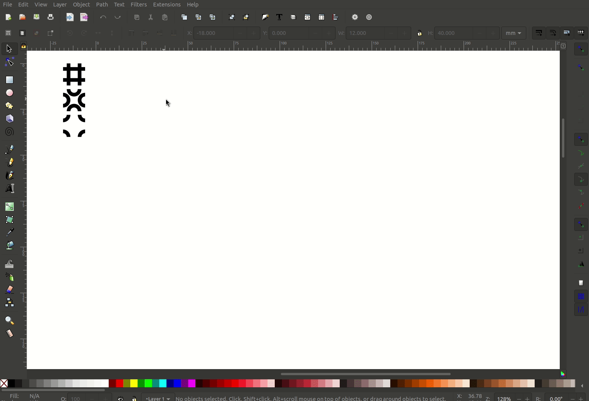

# Truchet Inkscape
> An extension for Inkscape to generate Truchet tile patterns 

## Installation
1. Clone or download the zip of this repository
2. Copy the files from `extension_files` into your Inkscape user extensions folder (this can be found at `Edit>Preferences>System>Userextensions`)
3. Restart Inkscape

## Usage
### Prepare
1. Start the open the prepare menu `Extensions>Truchet Tiling>Prepare Truchet Tiles...`
2. Select the kind of shape you want to use, and if you would like grids for that shape to be enabled
1. Draw the tiles you wish to use over the guides.
1. Make each of the tiles it's own group element including the guides

### Tile
1. Select the tile groups you want to use
1. Start the extension `Extensions>Truchet Tiling>Truchet...`
1. Specify rows and Columns, and tiling shape
1. `Apply`

## Trouble shooting:
* It all looks jumbled: Make sure that you are using the guides and that the orientation and aspect ration remain the same

